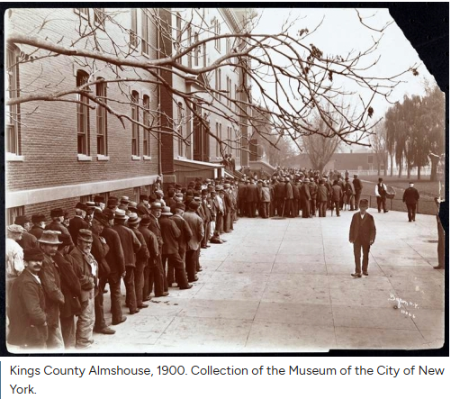

# Almshouses Spatial QSE Model

This repository contains sample Quantitative Spatial Economics (QSE) didactic models, to model migration patterns and 19th-century pauperism and almshouse dynamics.  Site renders at: https://jhconning.github.io/almshouses/

## Structure
- [Almshouses.ipynb](notebooks/Almshouses.ipynb): The core interactive simulation utilizing a Frechet-based migration framework to model the tradeoff between labor market wages and institutional relief benefits. Features a highly optimized Plotly `FigureWidget` UI for smooth, glitch-free visualization of spatial spillovers and macroeconomic shocks.

- [SFM_Spatial.ipynb](notebooks/SFM_Spatial.ipynb): Spatial General Equilibrium Model using a discrete choice framework, for migration decisions. Somewhat simpler thatn the other notebook, so a good place to start to understand the basics of the spatial general equilibrium framework. 

## Getting Started
To run the simulation locally, ensure you have the required dependencies installed (see `requirements.txt`).
